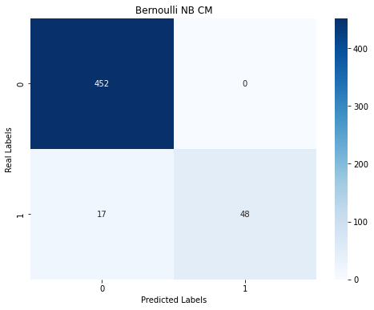

# SMS-spam-classifier

Performed EDA in which I checked how many characters, words a SMS has.

I applied some data processing techniques also did Vectorization in which I used CountVectorizer on the data using NLTK package.

I applied <b>Multinomial NB, Gaussian NB, Bernoulli NB</b> and using confusion matrix I figured out which one was performing well and as we want less False positives, I selected Bernoulli NB as False positives was 0 and also accuracy score was 97 percent.
I also applied Logistic Regression and the results were same as Bernoulli NB

Performance of different models :

+----------------+----------------+-----------------+
|     Model      | Accuracy Score | Precision Score |
+----------------+----------------+-----------------+
| Multinomial NB |      0.98      |       0.93      |
|  Gaussian NB   |      0.86      |       0.47      |
|  Bernoulli NB  |      0.97      |       1.0       |
|    Logistic    |      0.97      |       1.0       |
+----------------+----------------+-----------------+

Confusion matrix of Bernoulli NB Model :

